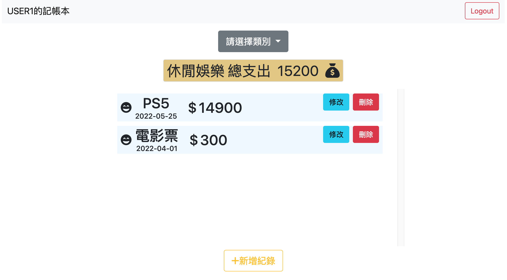
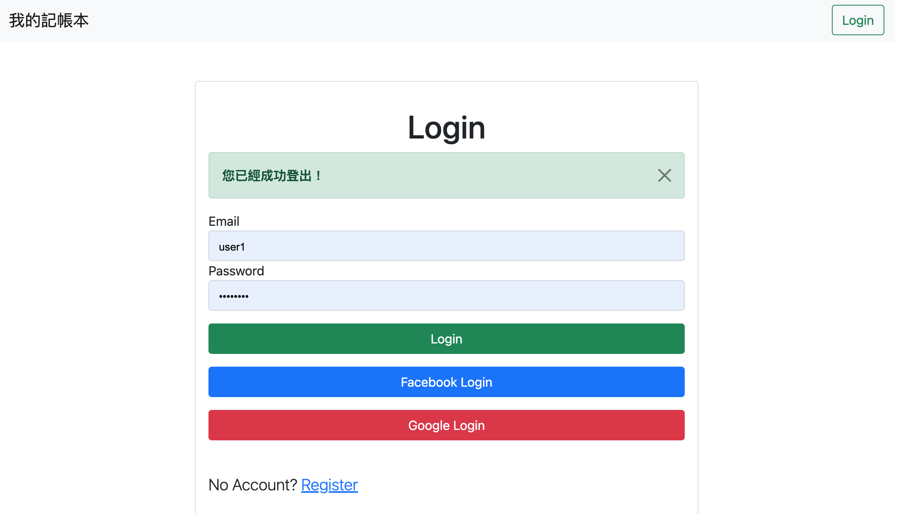

# 我的記帳本(Expense-Tracker)

---

---

## 介紹

---

可以用來記錄日常生活中的支出，註冊後以使用者身份記錄開支

### 功能列表

---

- 使用者可以在首頁看到所有記錄過後的項目：

  - 支出類別
  - 支出名稱
  - 支出日期
  - 支出金額
  - 顯示總支出

- 使用者可以點擊新增紀錄，並且輸入以下：

  - 名稱
  - 日期
  - 類別
  - 金額

- 使用者可以透過點擊修改按鈕來修改紀錄
- 使用者可以透過點擊刪除按鈕來刪除紀錄
- 使用者可以選擇類別並顯示不同類別的支出紀錄

---

### 開始使用

1. 請先確認有安裝 node.js 與 npm
2. 將專案 clone 到本地
3. 在本地開啟之後，透過終端機進入資料夾，輸入：
   `npm install`

4. 安裝完畢後，繼續輸入：
   `npm run seed` 創建種子資料
   `npm run dev` 啟用專案
5. 若看見此行訊息則代表順利運行，打開瀏覽器進入到以下網址
   `App is running on http://localhost:3000`
6. 若欲暫停使用
   `ctrl + c`

#### 置換.env.example 資料

若有需要測試 Facebook & Google 登入，請將.env.example 的副檔名(.example)刪除
並將內容，抽換成欲測試的開發人員資料
FACEBOOK_ID=XXX
FACEBOOK_SECRET=XXX
GOOGLE_CLIENT_ID=XXX
GOOGLE_CLIENT_SECRET=XXX

### 開發工具

- Node.js 14.19.1
- Express 4.17.3
- Express-Handlebars 4.0.2
- Method-override 3.0.0
- Mongoose 6.2.9
- Bootstrap 5.1.0
- Font-awesome 5.15.4
- Express-session 1.17.2
- bcryptjs 2.4.3
- Passport 0.5.2
- Passport-facebook 3.0.0
- passport-google-oauth20: 2.0.0
- Passport-local 1.0.0
- connect-flash 0.1.1
- dotenv 16.0.0
